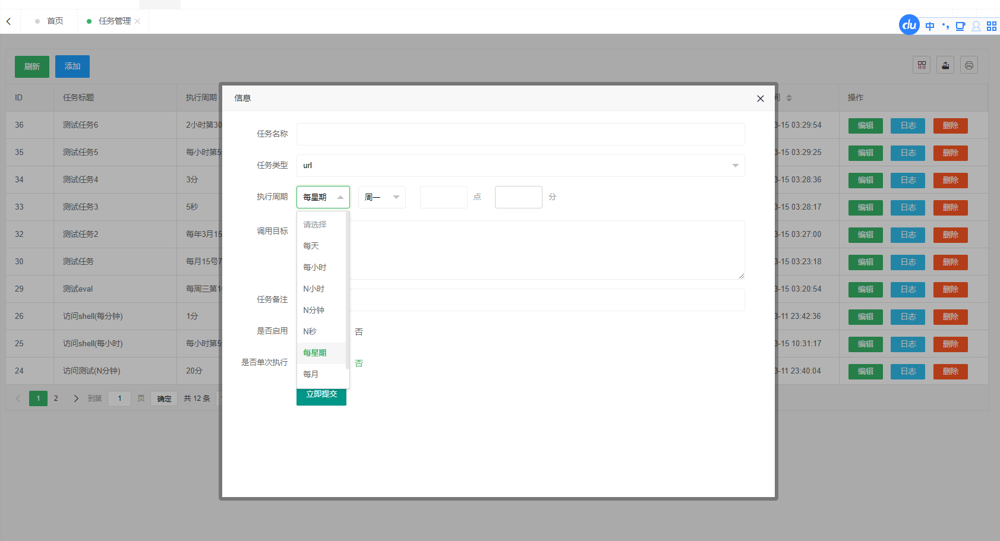
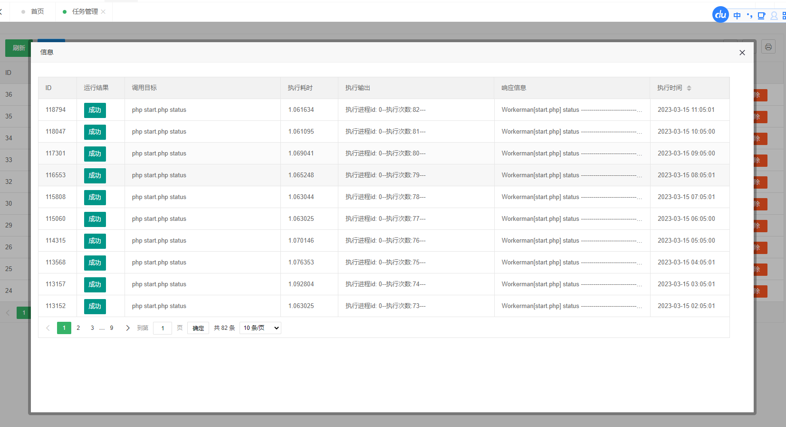

# workerman/crontab定时任务管理组件

## 概述

基于 **webman** + **workerman/crontab** 的动态定时任务管理组件<br>
本组件代码参考 **webman crontab任务管理组件(多类型)** https://www.workerman.net/plugin/42 <br>
重构出来的。<br>


## 介绍
基于php实现类似类似宝塔一样的计划任务

## 注意事项
仅测试了linux系统,windows与mac如果安装的话,不要开多进程,不要开多进程,不要开多进程

安装

```shell
composer require fly-cms/webman-crontab
```

## 使用
 创建任务数据表,这里数据表名称无限制.
```shell
 CREATE TABLE IF NOT EXISTS `system_crontab`  (
  `id` int(11) UNSIGNED NOT NULL AUTO_INCREMENT,
  `title` varchar(100) CHARACTER SET utf8mb4 COLLATE utf8mb4_general_ci NOT NULL COMMENT '任务标题',
  `type` tinyint(1) NOT NULL DEFAULT 1 COMMENT '任务类型 (1 command, 2 class, 3 url, 4 eval)',
  `rule` varchar(100) CHARACTER SET utf8mb4 COLLATE utf8mb4_general_ci NOT NULL COMMENT '任务执行表达式',
  `target` varchar(150) CHARACTER SET utf8mb4 COLLATE utf8mb4_general_ci NOT NULL DEFAULT '' COMMENT '调用任务字符串',
  `parameter` varchar(500)  COMMENT '任务调用参数', 
  `running_times` int(11) NOT NULL DEFAULT '0' COMMENT '已运行次数',
  `last_running_time` int(11) NOT NULL DEFAULT '0' COMMENT '上次运行时间',
  `remark` varchar(255) CHARACTER SET utf8mb4 COLLATE utf8mb4_general_ci NOT NULL COMMENT '备注',
  `sort` int(11) NOT NULL DEFAULT 0 COMMENT '排序，越大越前',
  `status` tinyint(4) NOT NULL DEFAULT 0 COMMENT '任务状态状态[0:禁用;1启用]',
  `create_time` int(11) NOT NULL DEFAULT 0 COMMENT '创建时间',
  `update_time` int(11) NOT NULL DEFAULT 0 COMMENT '更新时间',
  `singleton` tinyint(1) NOT NULL DEFAULT 1 COMMENT '是否单次执行 (0 是 1 不是)',
  PRIMARY KEY (`id`) USING BTREE,
  INDEX `title`(`title`) USING BTREE,
  INDEX `create_time`(`create_time`) USING BTREE,
  INDEX `status`(`status`) USING BTREE,
  INDEX `type`(`type`) USING BTREE
) ENGINE = InnoDB AUTO_INCREMENT = 1 CHARACTER SET = utf8mb4 COLLATE = utf8mb4_general_ci COMMENT = '定时器任务表' ROW_FORMAT = DYNAMIC
```
创建日志数据表
```shell
CREATE TABLE IF NOT EXISTS `system_crontab_log`  (
  `id` bigint UNSIGNED NOT NULL AUTO_INCREMENT,
  `crontab_id` bigint UNSIGNED NOT NULL COMMENT '任务id',
  `target` varchar(255) NOT NULL COMMENT '任务调用目标字符串',
  `parameter` varchar(500)  COMMENT '任务调用参数', 
  `exception` text  COMMENT '任务执行或者异常信息输出',
   `respond` text  COMMENT '执行任务的响应',
  `return_code` tinyint(1) NOT NULL DEFAULT 0 COMMENT '执行返回状态[0成功; 1失败]',
  `running_time` varchar(10) NOT NULL COMMENT '执行所用时间',
  `create_time` int(11) NOT NULL DEFAULT 0 COMMENT '创建时间',
  `update_time` int(11) NOT NULL DEFAULT 0 COMMENT '更新时间',
  PRIMARY KEY (`id`) USING BTREE,
  INDEX `create_time`(`create_time`) USING BTREE,
  INDEX `crontab_id`(`crontab_id`) USING BTREE
) ENGINE = InnoDB AUTO_INCREMENT = 1 CHARACTER SET = utf8mb4 COLLATE = utf8mb4_general_ci COMMENT = '定时器任务执行日志表' ROW_FORMAT = DYNAMIC
```

到配置目录下实现如下代码,示例代码如下:<br>
```shell

return [
    'enable' => true,
    'listen'            => '0.0.0.0:2345',
    'debug'             => true, //控制台输出日志
    'write_log'         => true,// 是否记录任务日志
    'redis' => [
        'host' => 'redis://127.0.0.1:6379',
        'options' => [
            'auth' => null,       // 密码，字符串类型，可选参数
        ]
    ],
    'getAllTask' => function(){
        //获取所有任务
        return \app\model\CrontabModel::select()->toArray();
    },
    'getTask' => function($id){
        //获取某个任务
        return \app\model\CrontabModel::where('id',$id)->find();
    },
    'writeRunLog' => function($insert_data){
        //写入运行日志
        \app\model\CrontabLogModel::insertGetId($insert_data);
    },
    'updateTaskRunState' => function($id, $last_running_time){
        //更新任务最后运行时间,这里要把运行次数加 1
        return  \app\model\CrontabModel::where('id',$id)
            ->update([
                'last_running_time' => $last_running_time,
                'running_times' => \think\facade\Db::raw(' running_times + 1')
            ]);
    }
];

```

接着打开配置目录下process.php 示例如下:<br>
注意事项,这里的端口要与上面端口进行对应
````shell
return [
    'webman-crontab'  => [
        'handler'     => \FlyCms\WebmanCrontab\Server::class,
        'count'       => 1,
        'listen' => 'text://0.0.0.0:2345',
    ]
];
````

## 用法
使用示例请参考test文件的内容

## 演示



